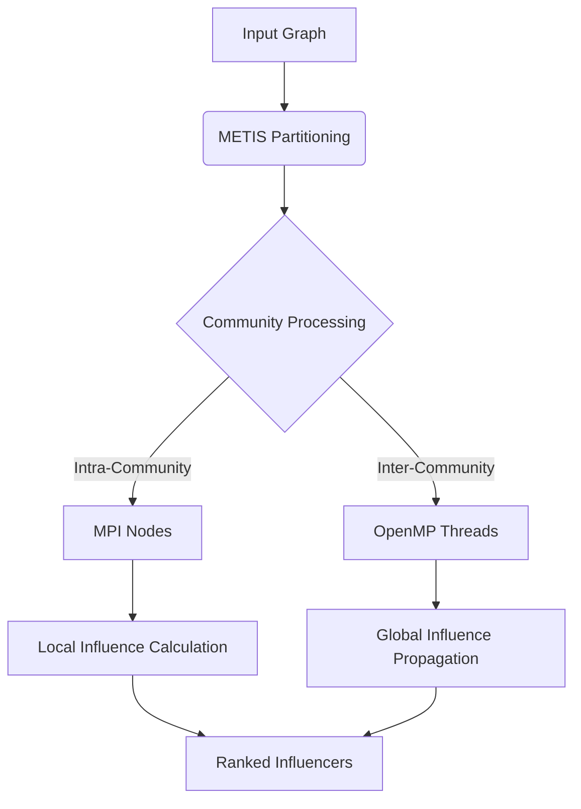

# METIS Graph Partitioning – Higgs Twitter Dataset


This repository contains partitioned graph data derived from various interaction networks in the Higgs Twitter dataset, using METIS (gpmetis) for community detection and parallel influence analysis algorithms.

## 👥 Development Team
- **Muhammad Daniyal Aziz** - Parallel Algorithm Design
- **Haleema Tahir** - Graph Analysis & Visualization  
- **Muhammad Bilal Khawar** - Performance Optimization

## 📜 Research Basis
Implementation of the parallel social behavior-based algorithm from:  
[Parallel Social Behavior-Based Algorithm for Influential Users Identification](https://drive.google.com/file/d/1vp5he-8ogdPJRFPiT6BDGPVZoH9CEnAh/view?usp=sharing)

## 🧠 Parallelization Strategy

### Hybrid MPI-OpenMP Architecture

## 📁 Dataset Overview
### Graph Partition Files (*.part.8)
- File Name	Description	Nodes	Edges
- higgs-retweet_network.graph.part.8	Retweet interactions	456,626	14,855,842
- higgs-mention_network.graph.part.8	Mention network	456,626	12,673,554
- higgs-reply_network.graph.part.8	Reply network	456,626	6,633,598


🧪 Running Influence Algorithms

 🔸 Serial Version

✅ **Compile:**
```bash
g++ -std=c++17 -O2 -o serial_influence serial_influence.cpp
````

🚀 **Run:**

```bash
./serial_influence
```

### 🔸 Parallel Version (Beowulf Cluster in Docker)

🐳 **Set Up Cluster:**

```bash
sudo docker pull i212498/mpiclone
git clone https://github.com/i212498/Beowulf-Cluster-Using-Docker.git
cd Beowulf-Cluster-Using-Docker
./makecluster.sh 8
```

🔁 **Inside Node 1:**

```bash
sudo docker exec -it node1 bash
cd /home/storage
```

💡 **Copy your code and input files from host into `/home/storage`.**

🛠 **Compile MPI Version:**

```bash
mpic++ -std=c++17 -O2 -o run_mpi run_mpi.cpp
```

🚀 **Run MPI Program:**

```bash
mpirun --hostfile machinefile -np 8 ./run_mpi
```

🧹 **Clean Up:**

```bash
./deletecluster.sh 8
```

---

## ⏱ Performance Analysis

### 🧮 Basic Timing

#### Serial:

```bash
time ./serial_influence
```

#### Parallel:

```bash
time mpirun --hostfile machinefile -np 8 ./run_mpi
```

### 🔍 Profiling with gprof

#### 🧰 Compile with Flags:

* **Serial**

```bash
g++ -std=c++17 -O2 -pg -o serial_influence serial_influence.cpp
```

* **MPI**

```bash
mpic++ -std=c++17 -O2 -pg -o run_mpi run_mpi.cpp
```

#### 🏃 Run:

```bash
./serial_influence
# OR
mpirun --hostfile machinefile -np 8 ./run_mpi
```

#### 📊 Analyze:

```bash
gprof ./serial_influence gmon.out > serial_profile.txt
gprof ./run_mpi gmon.out > mpi_profile.txt
```

### 🔎 MPI Profiling with mpiP

#### ⚙️ Compile:

```bash
mpic++ -std=c++17 -O2 -o run_mpi run_mpi.cpp -lmpiP -lm -lbfd -liberty -lunwind -lz
```

#### 📈 Run:

```bash
mpirun --hostfile machinefile -np 8 ./run_mpi
```

### 📈 TAU Performance System

✅ **Load and Compile:**

```bash
module load tau
tau_cxx.sh -std=c++17 -O2 -o run_mpi run_mpi.cpp
```

🚀 **Run and Analyze:**

```bash
mpirun --hostfile machinefile -np 8 ./run_mpi
paraprof --pack run_mpi.ppk
paraprof run_mpi.ppk
```

### 💡 Intel VTune

#### 🔬 Collect Hotspots:

```bash
vtune -collect hotspots -result-dir vtune_results ./serial_influence
```

#### 🏃 OR for MPI:

```bash
mpirun --hostfile machinefile -np 8 vtune -collect hotspots -result-dir vtune_results ./run_mpi
```

#### 📊 View Report:

```bash
vtune -report summary -result-dir vtune_results
```

---

## 📌 Key Metrics to Compare

| Metric         | Description                            |
| -------------- | -------------------------------------- |
| Execution Time | Compare serial vs parallel             |
| Speedup        | Speedup = Serial Time / Parallel Time  |
| Efficiency     | Efficiency = Speedup / # of processors |
| MPI Overhead   | From mpiP profiling                    |
| CPU Hotspots   | From gprof or VTune                    |
| Load Balancing | From TAU profiler                      |

```

```
